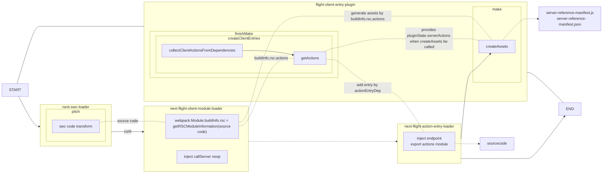

## 编译

[packages/next/src/build/webpack/loaders/next-swc-loader.ts](vscode://file///Users/ppdemoer/work/next.js/packages/next/src/build/webpack/loaders/next-swc-loader.ts)

<<< @/snippets/nextjs-snippets/compile/next-swc-loader.ts {all}{lines:true,maxHeight:'200px'}

[packages/next/src/build/webpack/loaders/next-flight-client-module-loader.ts](vscode://file///Users/ppdemoer/work/next.js/packages/next/src/build/webpack/loaders/next-flight-client-module-loader.ts)

<<< @/snippets/nextjs-snippets/compile/next-flight-client-module-loader.ts {all}{lines:true,maxHeight:'200px'}

[packages/next/src/build/webpack/plugins/flight-client-entry-plugin.ts](vscode://file///Users/ppdemoer/work/next.js/packages/next/src/build/webpack/plugins/flight-client-entry-plugin.ts)

<<< @/snippets/nextjs-snippets/compile/flight-client-entry-plugin.ts {all}{lines:true,maxHeight:'200px'}

[packages/next/src/build/webpack/loaders/next-flight-action-entry-loader.ts](vscode://file///Users/ppdemoer/work/next.js/packages/next/src/build/webpack/loaders/next-flight-action-entry-loader.ts)

<<< @/snippets/nextjs-snippets/compile/next-flight-action-entry-loader.ts {all}{lines:true,maxHeight:'200px'}

