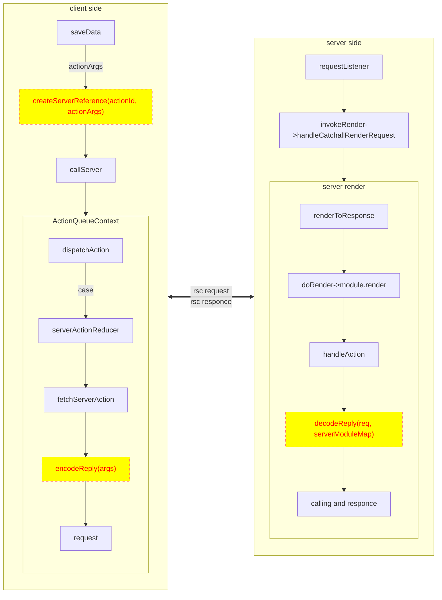
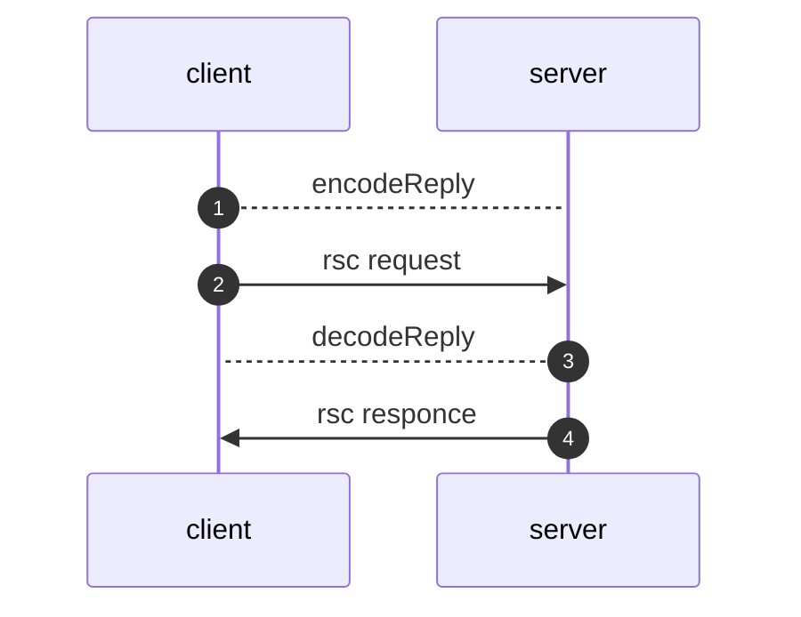
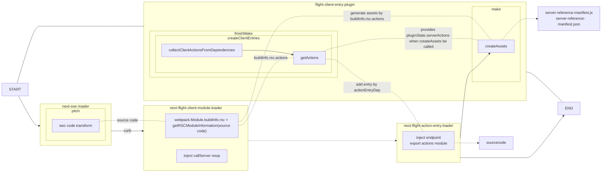

## 编译、过程执行

  ⛓️ 实现Server Action的RPC调用，有两个步骤，分别是 编译、过程执行

  

  

  

[packages/next/src/client/app-call-server.ts](vscode://file///Users/ppdemoer/work/next.js/packages/next/src/build/webpack/loaders/next-metadata-image-loader.ts)

<<< @/snippets/nextjs-snippets/runtime/call-server.ts{all}{lines:true}

  

  

[packages/next/src/build/webpack/loaders/next-flight-loader/action-client-wrapper.ts](vscode://file///Users/ppdemoer/work/next.js/packages/next/src/build/webpack/loaders/next-flight-loader/action-client-wrapper.ts)

<<< @/snippets/nextjs-snippets/runtime/action-client-wrapper.ts{all}{lines:true}

  

	  

[packages/next/src/shared/lib/router/action-queue.ts](vscode://file///Users/ppdemoer/work/next.js/packages/next/src/shared/lib/router/action-queue.ts)

<<< @/snippets/nextjs-snippets/runtime/action-queue.ts {4,10}{lines:true}

  

[packages/next/src/client/components/router-reducer/reducers/server-action-reducer.ts](vscode://file///Users/ppdemoer/work/next.js/packages/next/src/client/components/router-reducer/reducers/server-action-reducer.ts)

<<< @/snippets/nextjs-snippets/runtime/sever-action-reducer.ts {6}{lines:true}

  

[packages/next/src/client/components/router-reducer/reducers/server-action-reducer.ts](vscode://file///Users/ppdemoer/work/next.js/packages/next/src/client/components/router-reducer/reducers/server-action-reducer.ts)

<<< @/snippets/nextjs-snippets/runtime/fetch-server-action.ts {6,12}{lines:true}

  

[packages/next/src/server/lib/start-server.ts](vscode://file///Users/ppdemoer/work/next.js/packages/next/src/server/lib/start-server.ts)

<<< @/snippets/nextjs-snippets/runtime/start-server.ts {2,5,6,7,8,18}{lines:true}

  

[packages/next/src/server/lib/router-server.ts](vscode://file///Users/ppdemoer/work/next.js/packages/next/src/server/lib/router-server.ts)

<<< @/snippets/nextjs-snippets/runtime/invoke-render-and-call.ts {2,3,8,18-22,24}{lines:true}

  

[packages/next/src/server/base-server.ts](vscode://file///Users/ppdemoer/work/next.js/packages/next/src/server/base-server.ts)

<<< @/snippets/nextjs-snippets/runtime/do-render.ts {7,12,18,19,22,23}{lines:true}

  

[packages/next/src/server/future/route-modules/app-page/module.ts](vscode://file///Users/ppdemoer/work/next.js/packages/next/src/server/future/route-modules/app-page/module.ts)

[packages/next/src/server/app-render/app-render.tsx](vscode://file///Users/ppdemoer/work/next.js/packages/next/src/server/app-render/app-render.tsx)

<<< @/snippets/nextjs-snippets/runtime/renderToHTMLOrFlight.ts {2,4-11,14-18,22-28}{lines:true}

  

[packages/next/src/server/app-render/action-handler.ts](vscode://file///Users/ppdemoer/work/next.js/packages/next/src/server/app-render/action-handler.ts)

<<< @/snippets/nextjs-snippets/runtime/handleAction.ts {all}{lines:true}

  

	

	

		
	

